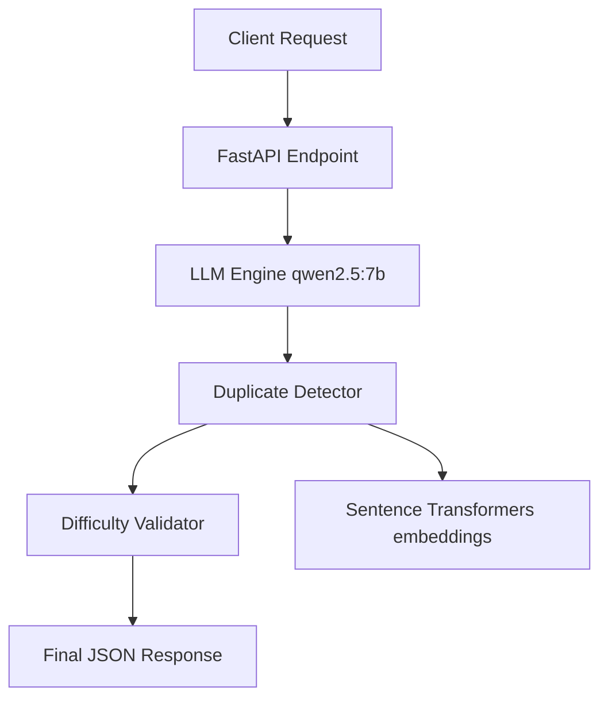

# Poly Prompt Engine


## Problem Statement
**National Hackathon 2026, PS-8**: Develop an automated question variation generation system that can intake a seed question and produce numerous diverse, semantically equivalent variations while maintaining specific difficulty constraints and eliminating duplicates.

## Features
- Automated Question Generation using local LLMs (Ollama)
- Embedding-based Cosine Deduplication
- Domain and Difficulty validation
- Structured JSON responses
- Complete API documentation

## Architecture


## Quick Start (Docker Compose)
1. Ensure Docker and Docker Compose are installed.
2. Run `docker-compose up -d`.
3. The API will be available at `http://localhost:8000`.

## Manual Setup
1. Install Python 3.11+.
2. Install dependencies: `pip install -r requirements.txt`.
3. Install and start Ollama locally.
4. Run `bash scripts/setup_ollama.sh`.
5. Run the app: `uvicorn app.main:app --host 0.0.0.0 --port 8000`.

## API Reference
- `GET /health` - Health check.
  ```bash
  curl http://localhost:8000/health
  ```
- `GET /domains` - List supported domains.
  ```bash
  curl http://localhost:8000/domains
  ```
- `POST /generate` - Generate variations.
  ```bash
  curl -X POST http://localhost:8000/generate -H "Content-Type: application/json" -d '{"seed_question": "What is 2+2?", "domain": "Mathematics", "count": 5}'
  ```

## Configuration
| Environment Variable | Description | Default |
|---|---|---|
| `OLLAMA_BASE_URL` | URL for Ollama | `http://localhost:11434` |
| `OLLAMA_MODEL` | Model to use | `qwen2.5:7b` |

## Testing
Run `pytest` in the root directory to execute the test suite.

## Tech Stack
| Component | Technology |
|---|---|
| Framework | FastAPI, Pydantic v2 |
| LLM Engine | Ollama (`qwen2.5:7b`) |
| Embeddings | `sentence-transformers` |
| Testing | Pytest, Pytest-Asyncio |

## License
MIT License
